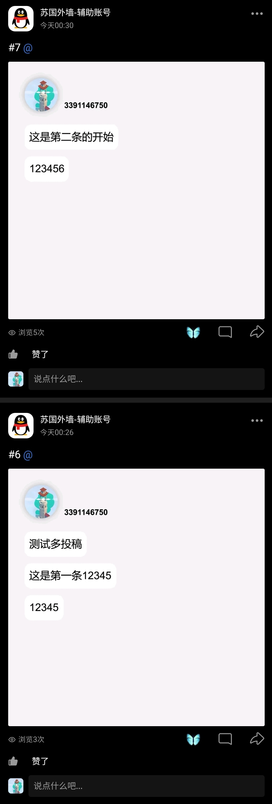
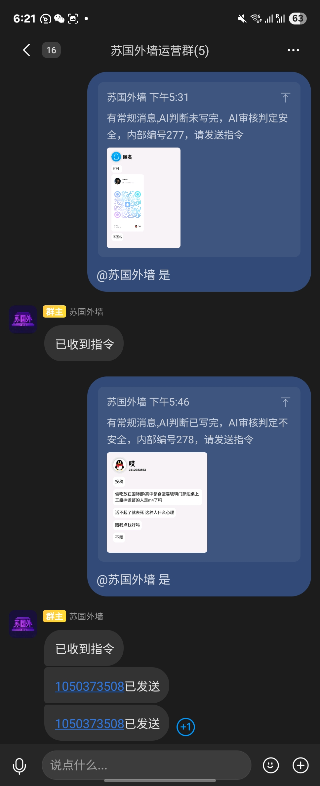
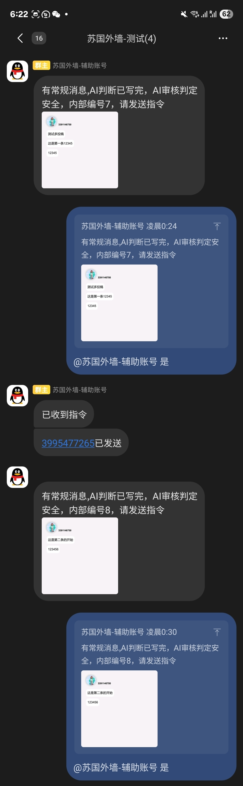
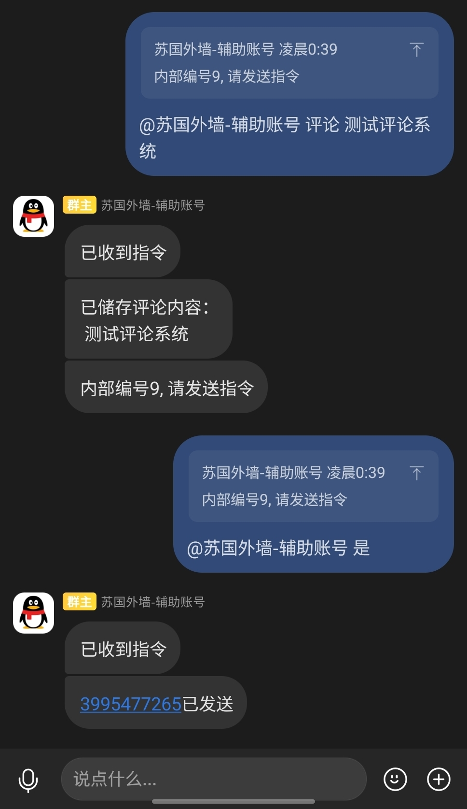
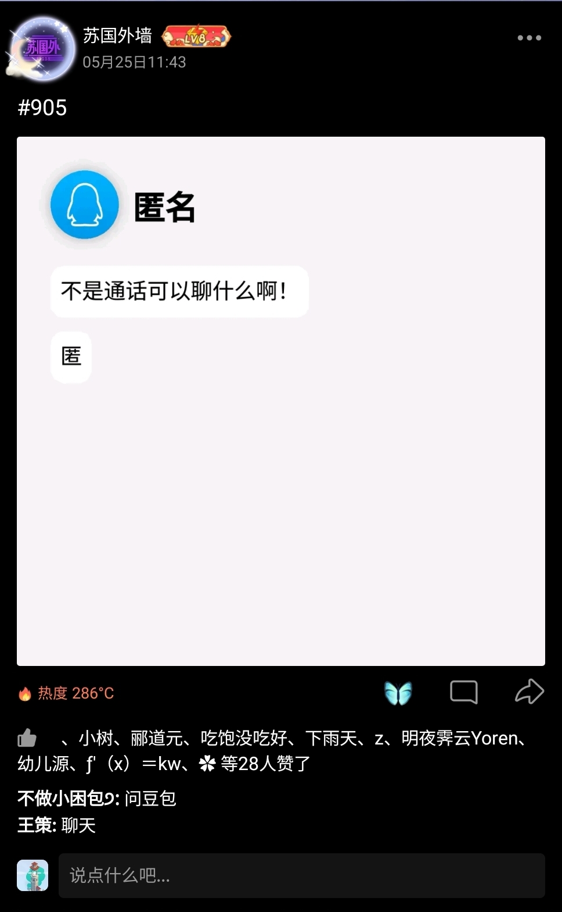
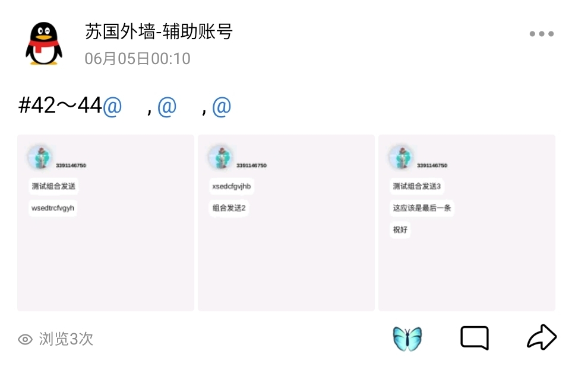

# OQQWall开放QQ校园墙自动运营系统
# 👍 稳定运行数千万秒 👍
## 目前系统已经有了基本的业务能力和错误处理能力，可以用在生产环境中
## 额外说明
紧急修复以外的所有commit上传之前会在我自营墙上测试一段时间再发布
 最稳定的版本永远是上一个次级版本的最后一个小版本
## 简介
本系统是一个校园墙自动运营系统，可以实现如下功能：
 获取用户投稿消息，通过大语言模型实现自动分段，自动判断匿名与否
 自动渲染图片，发到群中，通过群消息发送指令审核
 自动发送到qq空间。
 附加功能：
 [校园群智能助手](https://github.com/gfhdhytghd/OQQWall/wiki/%E6%A0%A1%E5%9B%AD%E7%BE%A4%E6%99%BA%E8%83%BD%E5%8A%A9%E6%89%8B)
 [多账号协同运营](https://github.com/gfhdhytghd/OQQWall/wiki/%E5%A4%9A%E8%B4%A6%E5%8F%B7%E5%8D%8F%E5%90%8C%E8%BF%90%E8%90%A5)

本系统专注于“墙”本身，适用于用户量5k以下的情况，致力于给用户提供QQ校园墙的无感的交互
 微信短时间内不会支持，因为没有找到linux能用的，好用的api。

本系统的技术实现方式不是很优雅，创建过程大量使用chatgpt编写实现小功能的脚本，并最终由一个bash把所有东西都串起来，不过他确实能跑起来。
 编写和测试平台是主线ArchLinux，作者目前使用的生产环境是阿里云的ubuntu 22.04 x64 UEFI版本。

本系统拥有处理并发的能力，允许的最小投稿时间间隔是无限小，最大并行处理能力取决于你的电脑内存大小和管理员响应速度。平均一个稿件从收到首条消息到发出要三分钟。

已知问题如下：
 发件流程人在回路，管理不在线会导致帖子积压
 没有历史消息处理逻辑，onebot下线过程中的积压投稿无法处理

# 
文档

## 
 [快速开始](https://github.com/gfhdhytghd/OQQWall/wiki/%E5%BF%AB%E9%80%9F%E5%BC%80%E5%A7%8B) | [全部文档](https://github.com/gfhdhytghd/OQQWall/wiki)

<h3 align="center">使用效果展示</h3>

<table>
  <tr>
    <td align="center">
       
      单次多投稿发送效果
    </td>
    <td align="center">
       
      密集审核，队列发送
    </td>
    <td align="center">
       
      允许处理时间段内再次投稿
    </td>
  </tr>
  <tr>
    <td align="center">
       
      标准发送
    </td>
    <td align="center">
       
      管理员评论
    </td>
    <td align="center">
       
      自动匿名识别
    </td>
  </tr>
  <tr>
     <td align="center">
       
      图片渲染与单独发送
    </td>
    <td align="center">
       
      表情包渲染
    </td>
    <td align="center">
       
      支持多投稿合并发送
    </td>
    <td></td>
  </tr>
</table>

## 开源项目列表

本项目使用或参考了以下开源项目：  
[Campux](https://github.com/idoknow/Campux)  
[Python](https://www.python.org/)  
[dashscope](https://github.com/dashscope)  
[with-ai-agents](https://github.com/yejue/with-ai-agents)  
[napneko](https://napneko.github.io/zh-CN/)  
[liteloaderqqnt](https://liteloaderqqnt.github.io/)  
[LLOneBot](https://github.com/LLOneBot/LLOneBot/)  
[Lagrange.onebot](https://github.com/LSTM-Kirigaya/Lagrange.onebot)  
[Stapxs QQ lite](https://github.com/Stapxs/Stapxs-QQ-Lite-2.0)  
感谢各位对自由软件与本项目作出的贡献！

